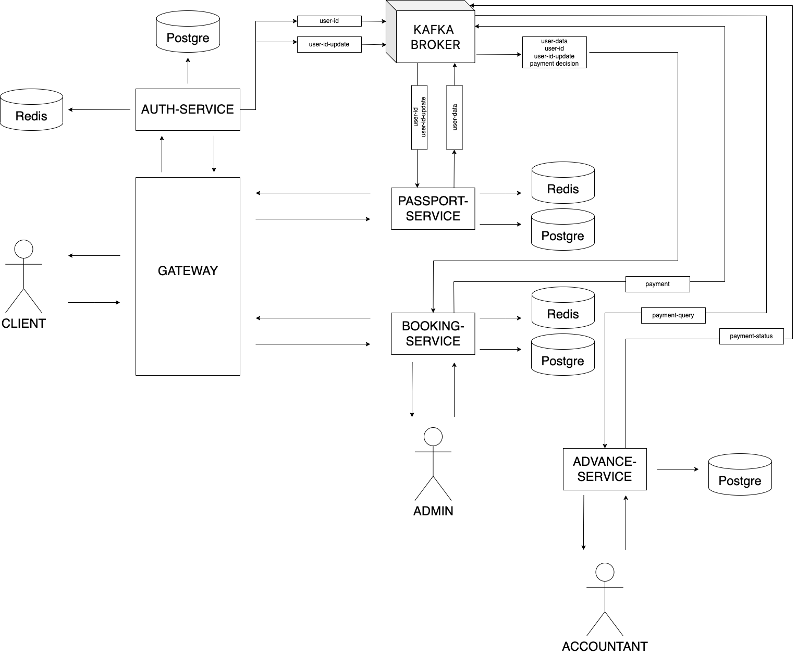

## Booking Service (MTS-Fintech Hackathon)
Microservice architecture, REST, Redis caching, authorization and authentication Spring Security && JWT, Postgre DB, routing via Spring Cloud Gateway, Eureka Server/Client, broker - Kafka, Docker/Docker-compose.

## Application architecture

If you have any questions, write to telegram: @kornelikkk
